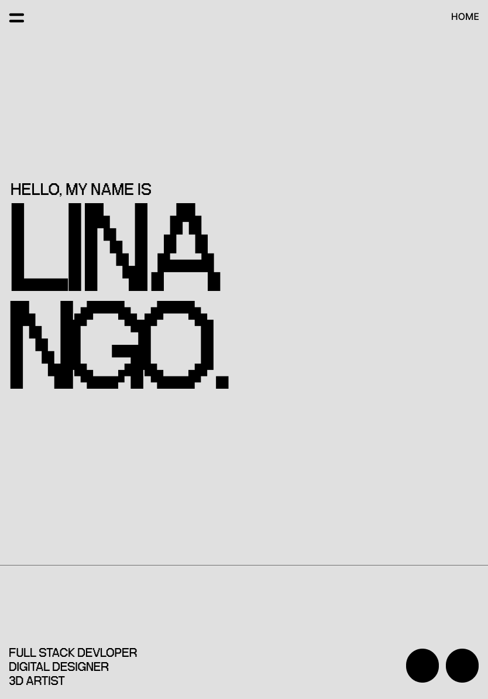
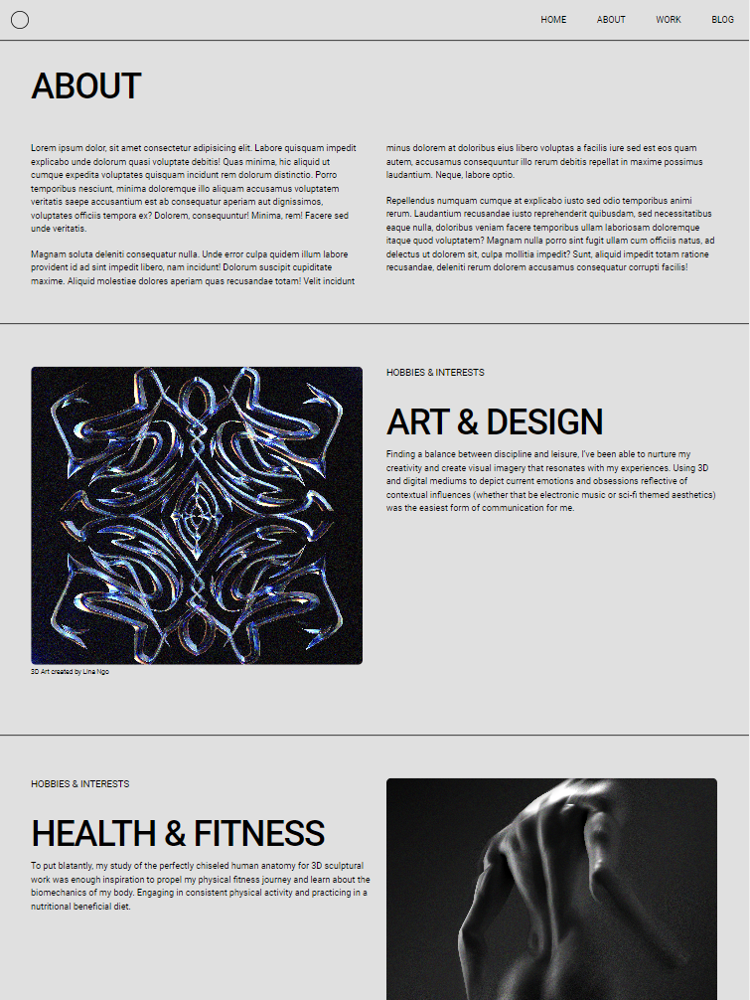
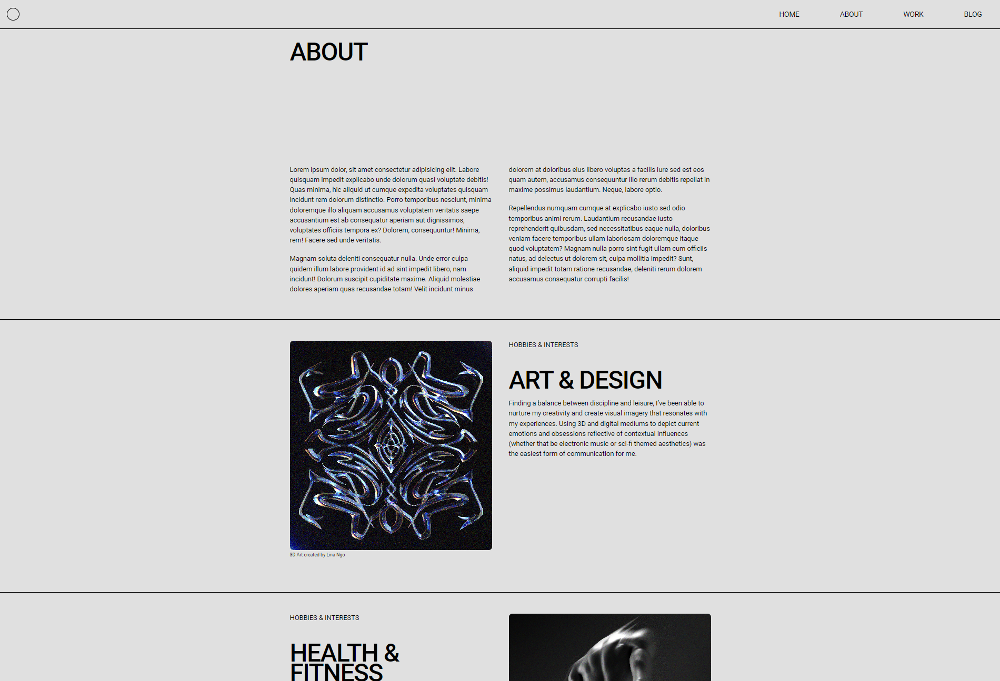
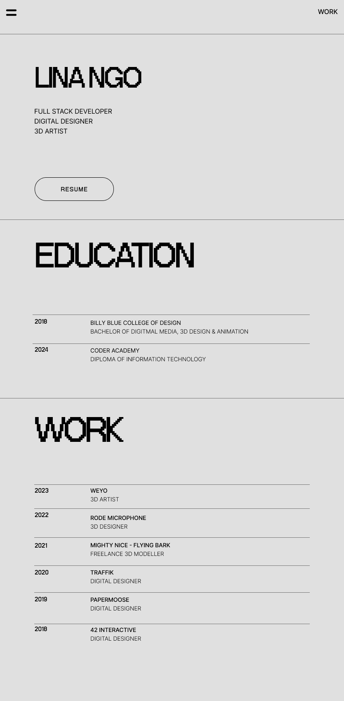

# TIA2 - Lina Ngo  

  

## Purpose

The purpose of this portfolio website is (use as a contact point…) that can be shared with potential employers. It contains content about myself as a growing web development professional, my education and career history, and my contact information. Displays my skills through the build of the website itself.

The purpose of this online portfolio is to provide information about myself as an aspiring web developer. It will contain information about my skills, interests, professional knowledge and a showcase of work. 

## Target Audience

- Potential Employers 
- IT recruitment

## Site Map

  

## Functionality / Features

### Navigation

#### Navigation bar - Tablet and Desktop (mockup)

- The navigation bar remains static at the top of the page. It contains a logo to the left and the options to navigate to on the right.  
- The navigation bar remains consistent throughout all pages, except when in mobile display.

#### Navigation bar - Mobile (mockup)

- When the user is in mobile display, the navigation bar will collapse into a hamburger icon (created in css) to the left and only the page title will remain to the right. By doing this, the navigation bar will look less condensed and cluttered, thereby keeping a clean and minimal aesthetics when in mobile display mode, consequently improving user experience. 

#### Menu page - Mobile (mockup)

#### Menu page - Mobile (screenshot)

- During mobile display mode, when the hamburger icon is clicked, the user will be directed to a new page clearly displaying all options to navigate to. 
- The **X** button at the top left of the page (created using css) will return user to the previous page.

  

### Home Page

The home page consist of 2 sections:

1. Main element - contains the introduction
2. The footer - contains job title and social media links.

All sections in the home page are combined to take up 100% of viewport height. Since the main purpose of this page is to display the introduction and not much else, it takes up majority of the screen space. The footer contains job titles and social media links represented as its respective logos. Intentionally there is no vertical scrolling to maintain simplicity of the page.

#### Home - Social Media Links

#### Home - Mobile (mockup)

#### Home - Mobile (screenshot)

  

#### Home - Tablet (mockup)

- Initially during the mockup stages of the website in tablet display, the nagivation bar was designed to remain collapsed as a hamburger icon as it does during mobile display. However, when implementing the design, the top of the page looked too empty, throwing off the visual balance of all the elements. So, the tablet display has the same navigation features as the desktop display.

#### Home - Tablet (screenshot)

  

#### Home page - Desktop (mockup)

#### Home - Desktop (screenshot)

  

### About Page

The about page consist of 2 sections:

1. About me 
2. Hobbies and interests that has 2 sub sections. 

Originally, the design of the website was to use inverted colours for every second section in order to create a clear distinction between content. However, when it was developed and interacted with the black blockouts became too visually heavy on the page and was not aesthetically pleasing. This led to a decision to maintain a minimal consistency seen in the home page, using only borders to separate sections. 

#### About - Mobile (mockup)

#### About - Mobile (screenshot)

#### About - Tablet (mockup)

- When the screen size increased, the sections split into two columns to fit more content horizontally on the page. This was done to avoid excessive vertical scrolling.
- The images were made to maintain the same width as the column, creating uniformity throughout the page.

#### About - Tablet (screenshot)

#### About - Desktop (mockup)

- Originally, the desktop display was designed using a four column structure. This was done to use the horizontal space given. By doing this, the **about text** was justified to the left of the page, while splitting into two columns. This is also done to the hobbies and interests sections to allow the image to take up more space (3 columns), emphasising its visual appeal. However, when the design was implemented, it was found that when the screen size decreased, even a little, the columns would become drastically slim thus creating an ugly display of text. This was mitgated by keeping the layout consistent with the tablet display. 

#### About - Desktop (screenshot)

  

### Work Page

After redesigning the **about page** that uses borders rather than colour blocks, the other pages were revisited and redesigned in that manner for consistency.

The **work page** consists of 3 sections:

- Information about self, contains a resume link (This section was added later in the design process)
- Education history
- Work history

#### Resume button

- The resume link is created as a button.
- It resizes when the width of the section changes. 
- Colours invert when mouse is hovered over. 

#### Work - Mobile (mockup 1)

#### Work - Mobile (mockup 2)

- The first section containing the name and current job titles were added later in the design process to link the page back to who the website is about. 

#### Work - Mobile (screenshot)

- The resume link was moved to the top section for easier accesibility. 

#### Work - Tablet (mockup 1)

#### Work - Tablet (mockup 2)

#### Work - Tablet (screenshot)

#### Work - Desktop (mockup 1)

- To remove excessive vertical scrolling, the desktop display was designed to use the horizontal space. This was achieved using flexbox. 

#### Work - Desktop (mockup 2)

#### Work - Desktop (screenshot)

  

### Blog Index

The **blog index** consists of 2 sections:

- The header
- The main content being the list of blog posts

The blog index uses css grids for the main content in order to create columns depending on screen size. This reduces excessive empty space and allows users to easily view all listed blog posts.

- Mobile - 1 column
- Tablet - 2 columns
- Desktop - 3 columns

#### Blog Index - Mobile (mockup)

#### Blog Index - Mobile (screenshot)

#### Blog Index - Tablet (mockup)

#### Blog Index - Tablet (screenshot)

#### Blog Index - Desktop (mockup)

#### Blog Index - Desktop (screenshot)

  

### Blog Post

All five blog posts maintain the same code but images and text can be rearranged in html according to content.

The **blog posts** consists of 2 sections:

- The header
- The main content that contains the body of text and images. 

The image blocks will stretch to fill the width of the text in order to maintain a sense of flow throughout the page. Images are given a maximum height as to not over fill vertical space.

#### Blog Post - Mobile (mockup)

#### Blog Post - Mobile (screenshot)

#### Blog Post - Tablet (mockup)

- The original design of this page was inspired by newspaper layouts. The idea was to restrict the amount of words to each line for easier legibility.
- After revising, it was decided to maintain the uniformity of one column for each display, as the break points for two columns would be unknown and inconsistent to each new post.

#### Blog Post - Tablet (screenshot)

#### Blog Post - Desktop (mockup)

- As the screen widens, the body of content will reach a maximum width to avoid the stretching of content. Ensuring that the page is easy to read. 

#### Blog Post - Desktop (screenshot)

  

## Fonts

- Fonts chosen during the mockup stage allowed for creative freedom in Figma, which led to the use of interesting fonts. However, after researching the accesibiility of web, I decided to choose a font that was accessible to all in order to maintain consistency to all users.

## Tech Stack

- HTML
- CSS