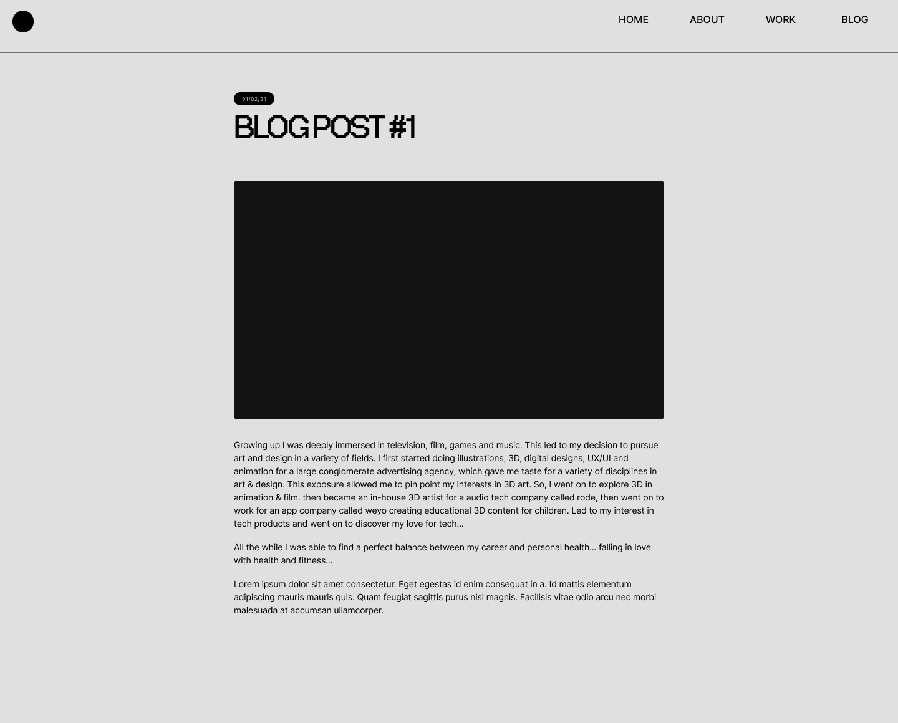

# TIA2 - Lina Ngo  

  

## Purpose

The purpose of this portfolio website is (use as a contact point…) that can be shared with potential employers. It contains content about myself as a growing web development professional, my education and career history, and my contact information. Displays my skills through the build of the website itself.

  

## Functionality / Features

### Navigation

#### Navigation bar - Tablet and Desktop (mockup)

- The navigation bar remains at the top of the page. It contains a logo to the left and the options to navigate to on the right.  
- The navigation bar remains consistent throughout all pages, except when in mobile display.

#### Navigation bar - Mobile (mockup)

- When the user is in mobile display, the navigation bar will collapse into a hamburger icon (created in css) to the left and only the page title will remain to the right. By doing this, the navigation bar will look less condensed and cluttered, thereby keeping a clean and minimal aesthetics when in mobile display mode, consequently improving user experience. 

#### Menu page - Mobile (mockup)

- During mobile display mode, when the hamburger icon is clicked, the user will be directed to a new page clearly displaying all options to navigate to. 
- The **X** button at the top left of the page, created using css, will return user to the previous page.

  

### Home Page

The home page consist of 3 sections:

1. Navigation Bar
2. Main element - contains the introduction
3. The footer - contains job title and social media links.

All sections in the home page are combined to take up 100% of viewport height. Since the main purpose of this page is to introduce myself, the introduction takes up majority of the screen space. The footer contains job titles and social media links represented as circles. 

#### Home page - Mobile (mockup)

  

#### Home page - Tablet (mockup)

- Initially during the mockup stages of the website in tablet display, the nagivation bar was designed to remain collapsed as a hamburger icon as it does during mobile display. However, when implementing the design, the top of the page looked too empty, throwing off the visual balance of all the elements. So, the tablet display has the same navigation features as the desktop display.

  

#### Home page - Desktop (mockup)

  

### About Page

The about page consist of 2 sections:

1. About me section.
2. Hobbies and interests section that has 2 sub sections. 

Originally, the design of the website was to use inverted colours for every second section to create a clear distinction. However, as it was being developed, the ability to interact with the website responsively proved that the black blockouts were too contrasty. This led to a decision the minimal consistency seen in the home page, as it only uses a border to separate sections. 

#### About - Mobile (mockup)

#### About - Tablet (mockup)

#### About - Desktop (mockup)

  

### Work Page

After completeing the about page, I decided to revisit the design of the work page and follow the more minimalistic approach using borders to separate sections rather than color blocks. 

#### Work - Mobile (mockup 1)

#### Work - Mobile (mockup 2)

#### Work - Tablet (mockup 1)

#### Work - Tablet (mockup 2)

#### Work - Desktop (mockup 1)

#### Work - Desktop (mockup 2)

  

### Blog Index

#### Blog Index - Mobile (mockup)

#### Blog Index - Tablet (mockup)

#### Blog Index - Desktop (mockup)

  

### Blog Post

#### Blog Post - Mobile (mockup)

#### Blog Post - Tablet (mockup)

#### Blog Post - Desktop (mockup)

  

### Colours & Fonts

### Site Map

### Target Audience

### Tech Stack